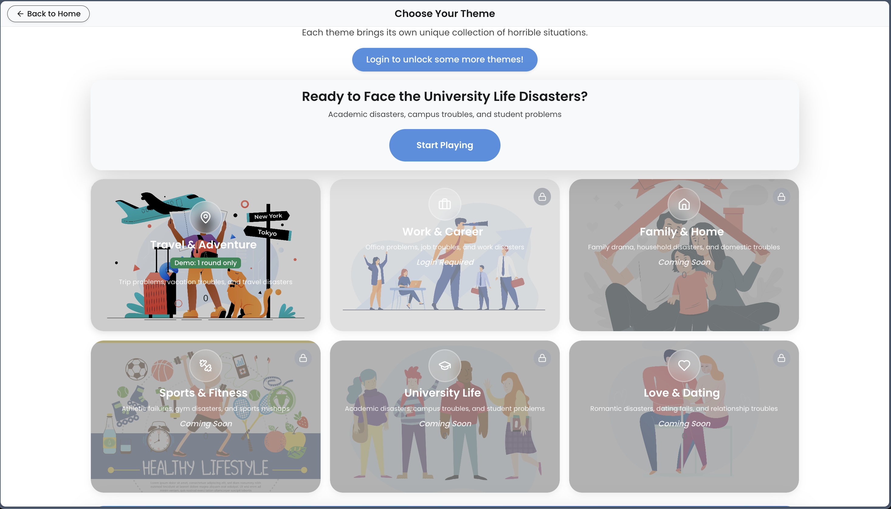
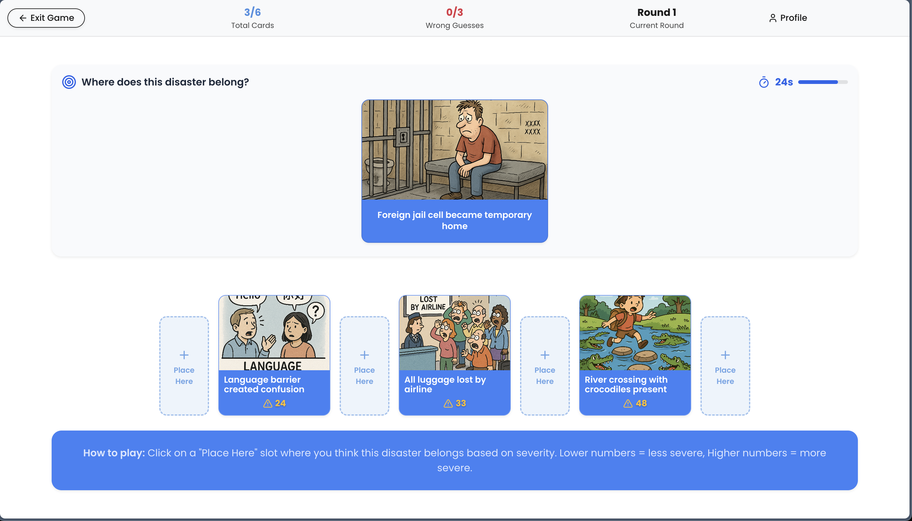
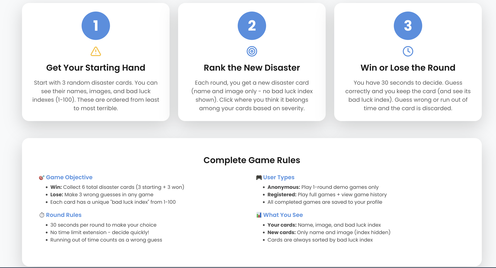
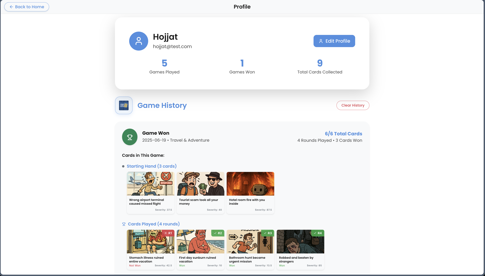

# Exam #1: "Stuff Happens - Card Ranking Game"
## Student: s334026 Miryavifard Hojjat

## React Client Application Routes

- Route `/`: Main landing page with welcome screen and navigation to game features
- Route `/themes`: Theme selection page showing available game themes (work, travel disasters)
- Route `/profile`: User profile page with statistics and game history
- Route `/game`: Interactive card ranking game where players rank disaster cards by severity
- Route `/login`: Authentication page with login and registration forms

## API Server

- PUT `/api/users/:id`
  - request parameters: id (user ID)
  - request body: {username, email, name}
  - response: 200 user updated successfully or 422 validation errors  
- POST `/api/sessions`
  - request body: {username, password}
  - response: 201 with authenticated user object or 401 authentication failed
- GET `/api/sessions/current`
  - response: current authentication status and user info
- DELETE `/api/sessions/current`
  - response: logout current user session
- GET `/api/themes`
  - response: list of available game themes
- GET `/api/themes/:id/cards`
  - request parameters: id (theme ID), count (optional, number of cards)
  - response: cards from specified theme
- POST `/api/game-sessions`
  - request body: {theme_key}
  - response: new game session with starting hand cards
- GET `/api/game-sessions/active`
  - response: current active game session for logged-in user
- GET `/api/game-sessions/:id`
  - request parameters: id (game session ID)
  - response: game session details
- GET `/api/game-sessions/:id/rounds`
  - request parameters: id (game session ID)
  - response: all rounds for the game session
- GET `/api/game-sessions/:id/next-card`
  - request parameters: id (game session ID)
  - response: next card to rank with persistent timer
- POST `/api/game-sessions/:id/rounds`
  - request parameters: id (game session ID)
  - request body: {round_number, card_id, user_choice_position, time_taken}
  - response: round results with correct position and card severity
- POST `/api/game-sessions/:id/end`
  - request parameters: id (game session ID)
  - response: game session ended with final score
- GET `/api/users/:id/history`
  - request parameters: id (user ID)
  - response: user's game history summary
- GET `/api/users/:id/history/:gameId`
  - request parameters: id (user ID), gameId (game session ID)
  - response: detailed round-by-round game history
- DELETE `/api/users/:id/history`
  - request parameters: id (user ID)
  - response: clears user's game history

## Database Tables

- Table `users` - contains user authentication (username, email, password_hash, salt) and basic info (name)
- Table `themes` - contains game themes (theme_key, name, description, icon, color, background_image, category, difficulty_level, is_active, requires_login)
- Table `cards` - contains disaster cards (theme_id, title, description, bad_luck_severity, image_url)
- Table `game_sessions` - contains game session tracking (user_id, theme_id, status, current_round, current_round_start_time, cards_won, wrong_guesses, final_score, game_result, time_started, time_finished)
- Table `game_rounds` - contains detailed round data (game_session_id, round_number, card_id, user_choice_position, correct_position, is_correct, time_taken, points_earned)

## Main React Components

- `Homepage` (in `Homepage.jsx`): Landing page with game introduction and navigation options
- `Game` (in `Game.jsx`): Main game component with card ranking gameplay, persistent timer, game resume functionality, and anti-exploit features
- `Themes` (in `Themes.jsx`): Theme selection interface with theme cards and demo/login requirements
- `Profile` (in `Profile.jsx`): User profile with game history display and statistics dashboard
- `Login` (in `Login.jsx`): Authentication forms for login and user registration
- `AuthProvider` (in `AuthContext.jsx`): Context provider for user authentication state management
- `ThemeProvider` (in `ThemeContext.jsx`): Context provider for dark/light theme switching

## Screenshots

### Homepage

### Theme Selection

### Game Interface

### Game Features

### Game Rules

### User Profile

### Login Page

## Users Credentials

- admin, admin123 
- hojjat, hojjat123 
- FulvioCorno, fulviocorno123 
- FrancescaRusso, francescarusso123 
